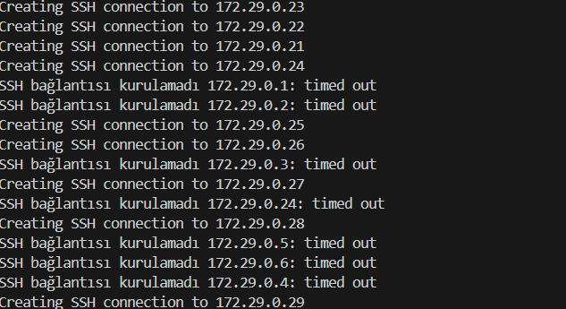

# SSH Bağlantısı ve Ağ Üzerinden Komut Gönderimi

Bu proje, bir Linux sunucusuna SSH bağlantısı kurarak uzaktan komut veya yapılandırma dosyası göndermeyi amaçlayan bir Python sınıfı içerir. Proje, belirli bir ağdaki cihazlara eşzamanlı olarak komutlar gönderilmesine olanak tanır. Bu sayede aynı anda birden fazla cihazda işlem yapılabilir.

Python'un paramiko, asyncio ve ipaddress gibi kütüphaneleri kullanılarak ağdaki cihazlara verimli ve hızlı bir şekilde komut gönderilir. Asenkron yapılar sayesinde çok sayıda cihazla aynı anda işlem yapılabilir. Projenin amacı, belirli bir ağ bloğundaki cihazlara SSH üzerinden komut göndermek ve bu komutların çıktısını almak, ayrıca cihazların durumlarını güncellemektir.

Kodun terminal çıktıları aşağıda verilmiştir. asyncio kütüphanesi ile asenkron bir şekilde bağlantılar kurulup komutlar gönderilmektedir.



## Özellikler

Bu projede aşağıdaki Python kütüphanelerine ihtiyaç vardır:

- **SSH Bağlantısı Kurma**: paramiko kütüphanesi kullanılarak, uzak Linux sunucularına güvenli bir SSH bağlantısı yapılır.
- **Eşzamanlı Komut Gönderimi**: asyncio kullanarak, belirtilen ağ bloğundaki tüm cihazlara eşzamanlı olarak komut gönderilir.
- **Ağ İzleme ve Keşif**: ipaddress kütüphanesiyle, verilen ağ bloğundaki tüm cihazlar keşfedilir ve her birine komut gönderilir.
- **Komut ve Yapılandırma Gönderimi**:  Hem komut çalıştırılabilir hem de yapılandırma dosyaları gönderilebilir. Bu sayede uzak sunucular üzerinde yapılandırmalar değiştirilebilir.


## Gereksinimler

Bu projede aşağıdaki Python kütüphanelerine ihtiyaç vardır:

- **paramiko**: SSH bağlantıları kurmak ve komutları çalıştırmak için kullanılan kütüphane
- **ipaddress**: IP adresi ve ağları yönetmek için kullanılan kütüphane.
- **asyncio**: Python'un asenkron programlama kütüphanesi.


## Projeyi Çalıştırma

Öncelikle aşağıdaki komut ile gerekli bağımlılıkları yükleyin:

```bash
pip install -r requirements.txt 
```


Ardından projeyi çalıştırın:

```bash
python main.py
```

## Proje Yapısı

- **SSHClient sınıfı**: SSH bağlantıları kurar ve komutları hem senkron hem de asenkron olarak çalıştırır. Ayrıca yapılandırma dosyalarını göndermek için de kullanılabilir.
- **send_commands_to_network()**: Belirtilen ağ aralığındaki tüm cihazlara komut gönderir ve sonuçları toplar.
