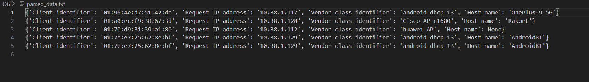

# DHCP Log İzleme ve Ayrıştırma Uygulaması

Bu proje, SSH üzerinden bir sunucuya bağlanarak sürekli akan DHCP log verilerini 300 saniye boyunca takip eden ve belirli DHCP mesajlarını ayrıştırarak ilgili verileri çıkaran bir Python uygulamasıdır. Uygulama, sürekli akan log verisi içinden "DHCPREQUEST" türündeki mesajları filtreler ve bu mesajlar içindeki belirli alanları parse eder.

Proje, "Client-identifier", "Request IP address", "Vendor class identifier" ve "Host name" gibi alanların verilerini çıkarmayı amaçlar ve bu verileri bir dosyaya veya veritabanına yazabilir.

Proje denenirken repo içerisinde bulunan data.txt içerisindeki veriler üzerinde çalışılmıştır. Projeyi çalıştırdıktan sonra oluşan parsed_data.txt dosyası aşağıda verilmiştir.


## Özellikler

Bu projede aşağıdaki Python kütüphanelerine ihtiyaç vardır:

- **SSH Üzerinden Log Dinleme**: paramiko kütüphanesi ile SSH bağlantısı kurularak, uzaktaki sunucudan log verileri gerçek zamanlı olarak okunur.
- **Log Parse İşlemi**: Python'un `re` modülü ile log verileri içinden "DHCPREQUEST" mesajları filtrelenir ve ilgili alanlar ayrıştırılır.
- **Dosyaya Yazma**: Elde edilen veriler bir dosyaya yazılır.
- **Zaman Sınırlaması**: Uygulama, belirli bir SSH komutunu 300 saniye boyunca dinleyerek belirlenen zaman diliminde veri toplar.

## Gereksinimler

Bu projede aşağıdaki Python kütüphanelerine ihtiyaç vardır:

- **paramiko**: SSH bağlantısı kurmak ve uzaktaki sunucudan log verisini almak için kullanılan kütüphane
- **re**: Python’un dahili regex modülü olup, log verisi ayrıştırma işlemlerinde kullanılır.
- **time**: Python’un zaman modülü, belirli bir süre boyunca log dinleme işlemi için kullanılır.

## Projeyi Çalıştırma

Öncelikle aşağıdaki komut ile gerekli bağımlılıkları yükleyin:

```bash
pip install -r requirements.txt 
```


Ardından projeyi çalıştırın:

```bash
python main.py
```

## Proje Yapısı

- **parse_logs(log_data)**: Verilen log verisini satır satır okuyarak "DHCPREQUEST" türündeki mesajları bulur ve ilgili alanları ayrıştırır.
- **check_section(section)**: Belirli bir log bloğunu inceleyerek "Client-identifier", "Request IP address", "Vendor class identifier" ve "Host name" gibi alanları parse eder ve bir sözlük olarak döner.
- **write_to_file(data, filename)**: Ayrıştırılmış verileri belirtilen dosyaya yazar.
- **listen_via_ssh(command)**: SSH bağlantısı kurarak uzaktaki sunucuda verilen komutu çalıştırır ve log verisini dinler; belirlenen süre boyunca ayrıştırılmış verileri toplar ve dosyaya yazar.
